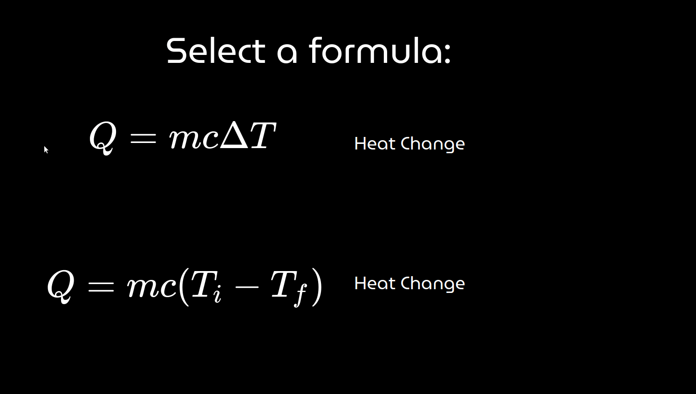

# TOCYEN
TOCYEN - The Only Calculator You'll Ever Need! Made primarily with JavaScript DOM elements and p5.js. (abandoned)

This is a neat proof of concept for a click-and-solve calculator that allows you to solve and rearrange formulas with a click of a button!
It was also a learning opportunity for me to see how I could manipulate DOM elements in order to make the screen scalable to any device and 
figure out how to algebraically rearrange formulas with a library, which was pretty cool.
Unfortunately, I've found it to be pretty useless compared to sites like Desmos.com or mathpapa.com, which is why this is discontinued. 
